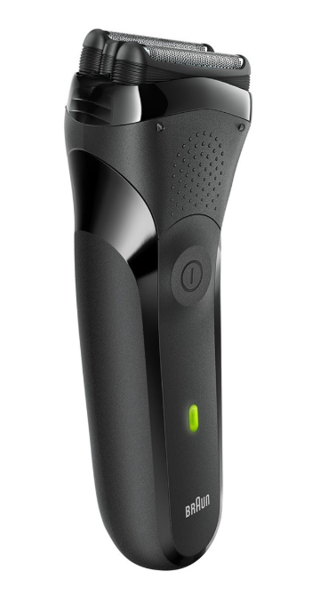
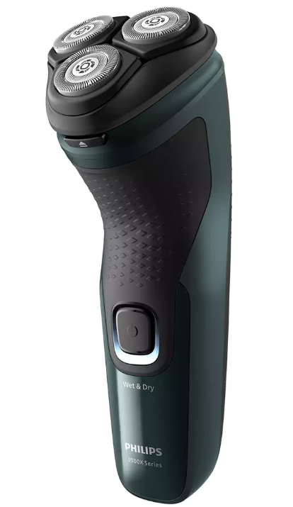

# Как выбрать идеальную электробритву?

## Основные типы бритв

### Сеточная бритва

Рабочий блок сеточной бритвы состоит из неподвижной сетки с мелкими ячейками, под которой быстро движутся лезвия. Щетина попадает в отверстия сетки и срезается лезвиями.

**Преимущества**: Идеальна для чувствительной кожи, минимизирует раздражение.

**Недостатки**: Может быть менее эффективна для длинной или густой щетины, бритье занимает больше времени.

### Роторная бритва

Роторная бритва оснащена круглыми, вращающимися ножами, расположенными в отдельных дисках. Ножи захватывают и срезают волоски, что обеспечивает гладкое и чистое бритье.

**Преимущества**: Эффективна для длинной щетины, обеспечивает очень гладкое бритье.

**Недостатки**: Может вызывать раздражение на чувствительной коже.

## Вывод

Выбор идеальной электробритвы — это баланс между вашими личными потребностями и функционалом устройства. Учитывайте свой тип кожи, частоту бритья и особенности щетины, и вы без труда найдете модель, которая сделает уход за собой комфортным и эффективным.
